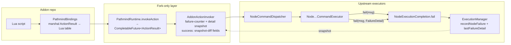

# Design: Action Result Envelopes

**Status:** implemented (2026-07-12; designed and shipped the same day). The
[Lua Scripting Reference](../guides/lua-scripting.md) documents the shipped
contract; this page keeps the design rationale.
**Supersedes:** the raise-on-every-failure semantics of the earlier strictness
work — a deliberate revision, not a contradiction; see "Why we are revising the
strict-raise model" below.

## Summary

Addon-invoked actions (`pathmind.invokeAction` and the `pathmind.*_` wrappers) will
return a **result table** instead of returning nothing, and **expected action
failures will be returned rather than raised**. Lua errors remain reserved for
script bugs and mod-internal errors.

```lua
local r = pathmind.craft_({ Item = "stone_pickaxe" })
if r.ok then
  print("crafted " .. r.produced)
elseif r.status == "missing_resource" then
  gather(r.missing)            -- machine-readable: e.g. { "minecraft:stick" }
elseif r.status == "transient" then
  pathmind.wait_({ Duration = 1 })
  -- retry
end
```

## The three failure classes

The model follows the intuition that action calls behave like web requests: a call
goes out, something happens, and it can succeed or fail in qualitatively different
ways. An HTTP client *returns* a 404 response but *throws* on `ECONNREFUSED` — the
same boundary applies here.

| Class | Meaning | Examples | Behavior |
|---|---|---|---|
| **1 — Caller error** (script bug) | The call itself is malformed; retry can never help | unknown action name, unknown parameter or mode, invalid item id, unknown key name | **raise** (already happens before dispatch in `AddonActionInvoker`) |
| **2 — Expected failure** (the world says no) | A normal outcome of trying things in a world; scripts plan around these | missing ingredients, no matching hotbar item, no route to target, entity not nearby, recipe needs a crafting table, GUI not open yet, trade out of stock | **return** `{ ok = false, status = …, … }` |
| **3 — Implementation error** (our bug) | Retry is pointless and we would want a bug report | interaction manager null, reflection failure, slot index out of bounds, unexpected `RuntimeException` | **raise** |

Borderline cases (e.g. "crafting screen closed mid-craft" — a legitimate world event
*or* a race in our click machinery) default to **class 2 with `status = "transient"`**:
regardless of whose fault it is, "wait and retry" is the right script reaction.
Class 3 is reserved for failures where a retry is provably useless.

## The envelope

Success:

```lua
{ ok = true, --[[ action-specific fields: ]] produced = 1 }
```

Expected failure (class 2):

```lua
{
  ok      = false,
  status  = "missing_resource",   -- symbolic string, never a number
  message = "Cannot craft Stone Pickaxe: missing required ingredients.",
  missing = { "minecraft:stick" } -- per-status machine-readable detail fields
}
```

**Status vocabulary v1** (strings — self-documenting in Lua; the HTTP-style numeric
codes from the original analogy were rejected as a wire-format legacy):

- `missing_resource` — required items/blocks absent; detail: `missing` list
- `precondition` — required state absent (GUI not open, wrong screen); establish it and retry
- `transient` — timing/desync/blocked route; wait and retry
- `unsupported` — the request cannot work this way (3×3 recipe in the 2×2 player grid)
- `not_found` — target entity/item/player not found nearby
- `no_route` — Baritone never started the navigation task (path unavailable); added
  by the Baritone-integration milestone (2026-07-13, see the
  [Baritone integration design doc](./baritone-integration.md))
- `off_target` — navigation ran and stopped, but the final position misses the goal
  (same milestone)
- `failed` — unclassified fallback; message only, no detail fields

An **unclassified** action failure returns `status = "failed"` with the executor's
human-readable message. Classification and machine-readable detail fields grow
incrementally — the taxonomy is attached where scripts actually need it, starting
with craft, interact/GUI preconditions, hotbar, and goto.

## Why we are revising the strict-raise model

The 2026-07-12 strictness work (route every executor failure path through
`NodeExecutionCompletion.fail`, turn recorded failures into Lua errors) fixed the
real disease: failures that were **invisible** — not even queryable (the CRAFT
silent no-op). The lesson from living with raise-everything is different: expected
failures are *results a script plans around*, and the mission scripts immediately
wrapped every call in `pcall`/`action()` helpers to get result-like ergonomics back.
An ignored return value is *ignorable*, but no longer invisible — that is the normal
responsibility any Result-style API gives its caller, and a deliberate trade we now
make knowingly. The strictness work is not wasted: the failure counter, the single
`fail()` choke point, and the guarantee that no failure path is silent are exactly
the infrastructure this model plugs into.

## Implementation sketch



- **Fork-only (no upstream touch):** the `ActionResult` API type (plain Java, map-based
  like the existing contract), the new `invokeAction` return type, Lua marshaling,
  and success-side data via before/after snapshots in the invoker (inventory diff →
  `produced`/`collected`, position → final coordinates).
- **Additive upstream touches (same category as the fail-routing sweep):**
  `NodeExecutionCompletion.fail` gains an overload with an optional `FailureDetail`
  (status + fields); existing callers stay valid. Individual `fail(…, msg)` sites
  become `fail(…, msg, FailureDetail.missingResource(items))` only where we want
  classification — one changed line per site, graph behavior identical (notification
  + continue-on-error, as before). Example: `canSatisfyGridIngredients` in the craft
  executor already computes what is missing and currently throws that knowledge away.
- **Graph side:** unchanged. The failure counter stays; `lastNodeFailureMessage` may
  become a structured `lastNodeFailureDetail` (the notification keeps showing the
  human string).
- **Deferred:** executor-side success instrumentation (e.g. CRAFT's internal
  `totalProduced` instead of the inventory diff) — only if the snapshot diff proves
  insufficient somewhere.

### Upstream-diff trade-off (maintainer note)

Every touched upstream line is potential rebase friction on the next upstream sync.
The zero-upstream-diff alternative — a message→status mapping table in the fork
layer — was considered and rejected: it breaks silently the moment upstream rewords
an error message. Explicit detail arguments at the (already fork-touched) `fail()`
sites are marginal extra diff and robust. The mapping table remains the fallback if
minimizing the fork diff ever becomes the priority (e.g. ahead of a large upstream
merge).

## Migration

- Only consumers today: the pathmind-lua addon and the mission presets. The mission's
  `action()`/`pcall` wrapper pattern becomes honest `if not r.ok` checks.
- Query functions (`getInventory`, `getPosition`, `getVar`, `getBlock`, …) are
  untouched — they return values, not envelopes.
- The mc-testkit spec `lua-craft-strict-fail.yaml` carries over as the red/green
  vehicle: its expectation flips from "craft_ raises" to
  `ok == false, status == "missing_resource"`.
- The strict-raise paragraphs in the [Lua Scripting Reference](../guides/lua-scripting.md)
  get replaced by the envelope contract when this ships.
