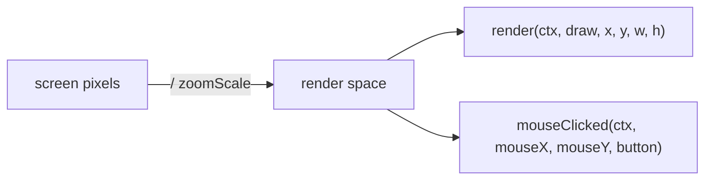

# Pathmind Addon API — Getting Started

This guide shows a third-party developer how to build an addon that registers
custom node types with Pathmind. After following this guide, your addon jar can
sit next to `pathmind.jar` and your nodes appear in the editor palette.

**API requirement IDs:** API-08, API-10

---

## Prerequisites

- Java 21+
- Gradle 8.x (use the Gradle wrapper)
- Architectury Loom 1.14.473 (must match Pathmind's Loom version — see `build.gradle.kts` below)
- Pathmind published to your local Maven (`~/.m2`) — see [Publish Pathmind to mavenLocal](#1-publish-pathmind-to-mavenlocal)
- Target: Minecraft 1.21.4 (Fabric)

---

## 1. Publish Pathmind to mavenLocal

Before you can compile your addon, publish Pathmind's API artifact to your local
Maven repository. From the **Pathmind repo** root:

```bash
./gradlew :fabric:publishToMavenLocal -Pmc_version=1.21.4
```

This installs `com.pathmind:pathmind-fabric:1.1.5+mc1.21.4` under `~/.m2/`.

**Cache-bust rule (important):** After every Pathmind rebuild, delete the Loom
remap cache in your addon repo before rebuilding:

```bash
rm -rf <your-addon>/.gradle/loom-cache/remapped_mods
```

Loom 1.14 caches remapped jars by version coordinate, not content hash
(Loom issue #1290). Skipping this step silently compiles your addon against a
stale API jar, causing `NoSuchMethodError` at runtime.

---

## 2. Create the addon project

### `settings.gradle.kts`

```kotlin
pluginManagement {
    repositories {
        maven("https://maven.architectury.dev/")
        maven("https://maven.fabricmc.net/")
        gradlePluginPortal()
    }
}

rootProject.name = "my-pathmind-addon"
```

### `gradle.properties`

```properties
maven_group=com.example
mod_version=0.1.0
minecraft_version=1.21.4
loader_version=0.17.3
pathmind_version=1.1.5+mc1.21.4
```

### `build.gradle.kts`

```kotlin
plugins {
    id("dev.architectury.loom") version "1.14.473"
    id("architectury-plugin") version "3.4.161"
}

group = property("maven_group") as String
version = property("mod_version") as String

repositories {
    mavenLocal()                               // must be FIRST — resolves Pathmind artifact
    maven("https://maven.architectury.dev/")
    maven("https://maven.fabricmc.net/")
    mavenCentral()
}

dependencies {
    minecraft("com.mojang:minecraft:${property("minecraft_version")}")
    mappings("net.fabricmc:yarn:1.21.4+build.8:v2")
    modImplementation("net.fabricmc:fabric-loader:${property("loader_version")}")
    modImplementation("net.fabricmc.fabric-api:fabric-api:0.119.4+1.21.4")

    // Pathmind API — compile-only, zero impl classes on your classpath
    modCompileOnly("com.pathmind:pathmind-fabric:${property("pathmind_version")}")
}

java {
    toolchain { languageVersion.set(JavaLanguageVersion.of(21)) }
}
```

---

## 3. Declare the entrypoint in `fabric.mod.json`

```json
{
  "schemaVersion": 1,
  "id": "my-addon",
  "version": "${version}",
  "name": "My Pathmind Addon",
  "environment": "client",
  "entrypoints": {
    "pathmind": ["com.example.myaddon.MyAddonEntrypoint"]
  },
  "depends": {
    "fabricloader": ">=0.17.3",
    "minecraft": "1.21.4",
    "java": ">=21",
    "pathmind": ">=0.1.0"
  }
}
```

The `"pathmind"` entrypoint key is what Pathmind discovers. The `"pathmind": ">=0.1.0"`
dependency entry lets the Fabric loader block hard version mismatches before your
addon even loads (two-layer compatibility check, D-11).

---

## 4. Implement `PathmindAddonEntrypoint`

```java
package com.example.myaddon;

import com.pathmind.api.addon.AddonNodeCategory;
import com.pathmind.api.addon.AddonNodeDefinition;
import com.pathmind.api.addon.NodeTypeRegistrar;
import com.pathmind.api.addon.PathmindAddonEntrypoint;

public class MyAddonEntrypoint implements PathmindAddonEntrypoint {

    private static final AddonNodeCategory MY_CATEGORY =
        new AddonNodeCategory(
            "myaddon.general",  // unique id — use your mod id as prefix
            "My Addon",         // display name in the sidebar
            0xFF4DB6AC,         // ARGB header color
            "*"                 // icon character (ASCII recommended)
        );

    @Override
    public void registerNodes(NodeTypeRegistrar registrar) {
        registrar.register(
            AddonNodeDefinition.builder("myaddon:my-node")
                .displayName("My Node")
                .category(MY_CATEGORY)
                .color(0xFF4DB6AC)
                .provenanceLabel("My Addon")   // provenance badge (D-07)
                .build(),
            new MyNodeExecutor(),
            new MyNodeSerializer()
        );
    }
}
```

### Node ID format

Node IDs must match the regex `^[a-z0-9_-]+:[a-z0-9_/.-]+$` (lowercase,
namespace-colon-name). Examples:

- `myaddon:my-node`  — valid
- `myaddon:nodes/special`  — valid
- `MyAddon:MyNode`  — INVALID (uppercase rejected)
- `../../../etc/passwd`  — INVALID (path traversal rejected)

IDs are validated at registration time; an invalid or duplicate ID throws
`IllegalArgumentException` and disables the entire addon.

---

## 5. Implement `AddonNodeExecutor`

```java
package com.example.myaddon;

import com.pathmind.api.addon.AddonNodeContext;
import com.pathmind.api.addon.AddonNodeExecutor;
import com.pathmind.api.addon.NodeResult;

import java.util.concurrent.CompletableFuture;

public class MyNodeExecutor implements AddonNodeExecutor {

    @Override
    public CompletableFuture<NodeResult> execute(AddonNodeContext ctx) {
        // Never block the game thread — return a CompletableFuture immediately.
        // Use CompletableFuture.supplyAsync(...) for off-thread work.
        return CompletableFuture.completedFuture(NodeResult.SUCCESS);
    }
}
```

`NodeResult` values: `SUCCESS` (advance graph), `FAILURE` (follow failure path or halt),
`SKIPPED` (advance as if SUCCESS).

---

## 6. Implement `AddonNodeSerializer`

```java
package com.example.myaddon;

import com.pathmind.api.addon.AddonNodeContext;
import com.pathmind.api.addon.AddonNodeSerializer;

import java.util.LinkedHashMap;
import java.util.Map;

public class MyNodeSerializer implements AddonNodeSerializer {

    private static final int CURRENT_SCHEMA_VERSION = 1;

    @Override
    public Map<String, Object> serialize(AddonNodeContext ctx) {
        Map<String, Object> fields = new LinkedHashMap<>();
        fields.put("_schema_version", CURRENT_SCHEMA_VERSION);   // REQUIRED
        fields.put("myField", ctx.getScriptText());               // your data
        return fields;
    }

    @Override
    public void deserialize(AddonNodeContext ctx, Map<String, Object> fields) {
        if (fields == null) {
            ctx.setScriptText("");
            return;
        }
        // GSON type erasure: JSON numbers come back as Double when target type is Object.
        // Use ((Number) fields.get("key")).intValue() — never (Integer) fields.get("key").
        Object rawVersion = fields.get("_schema_version");
        int schemaVersion = rawVersion != null ? ((Number) rawVersion).intValue() : 1;

        Object myField = fields.get("myField");
        ctx.setScriptText(myField instanceof String s ? s : "");
    }
}
```

**GSON Double-erasure caveat:** GSON deserializes JSON numbers as `Double` when
the declared field type is `Object`. Always read integers with `((Number) value).intValue()`.
A direct `(Integer)` cast will throw `ClassCastException` at runtime.

**`_schema_version` is mandatory.** Every `serialize` map must include it so
future addon versions can migrate stored data.

---

## 7. (Optional) Declare an `AddonNodeCategory`

Categories are declared as plain POJOs — not an enum — so addons can declare
their own sidebar groups at runtime (D-05):

```java
AddonNodeCategory category = new AddonNodeCategory(
    "myaddon.weapons",    // stable id used as map key
    "Weapons",            // human-readable sidebar header
    0xFFE57373,           // ARGB color
    "*"                   // icon character
);
```

---

## 8. (Optional) Render custom node body content

Implement `AddonNodeBodyRenderer` to draw custom content inside the node body:

```java
import com.pathmind.api.addon.AddonNodeBodyRenderer;
import com.pathmind.api.addon.AddonNodeContext;
import net.minecraft.client.MinecraftClient;
import net.minecraft.client.gui.DrawContext;

public class MyNodeRenderer implements AddonNodeBodyRenderer {

    @Override
    public void render(AddonNodeContext ctx, DrawContext draw, int x, int y, int width, int height) {
        // Called per-frame — must be fast and stateless.
        var textRenderer = MinecraftClient.getInstance().textRenderer;
        String text = ctx.getScriptText();
        if (text == null || text.isBlank()) return;
        draw.drawTextWithShadow(textRenderer, text, x, y, 0xFFCCCCCC);
    }
}
```

Pass the renderer to the builder: `.bodyRenderer(new MyNodeRenderer())`.

### Coordinate space and input handling

The `(x, y, width, height)` passed to `render()` is the node **body content area**
(already below the node header), in **render space**: the node graph draws under a
`scale(zoomScale)` matrix, so these are *not* raw screen pixels.

If your addon also implements `AddonNodeInputHandler` (keyboard/mouse for interactive
node bodies, like the Lua editor), the mouse coordinates you receive in `mouseClicked`
and `mouseScrolled` are converted to that **same render space** before they reach you —
hit-testing against the positions you computed in `render()` works at every zoom level.



Input-handler contract for interactive bodies:

- **Only consume clicks that land inside your interactive area** (return `false`
  otherwise). Consuming every click makes the node impossible to select or drag —
  header clicks must fall through to the graph.
- While your editor holds keyboard focus, return `true` from `keyPressed`/`charTyped`
  for **every** key, or keystrokes leak into graph shortcuts (Delete-node, arrow-pan).
- Release focus when a click lands outside your interactive area.

### Persisting edits: write them back to the context

The `AddonNodeContext` you receive in render and input callbacks is a **per-event
snapshot** of the node's stored fields — mutating your own widget state is not enough.
After every edit, commit the current value back with `ctx.setScriptText(...)`:
Pathmind syncs context mutations into the node's persisted fields after each input
dispatch. Skip this and your edits exist only in your widget — saving the preset or
running the graph will use the stale stored value.

Two related guarantees Pathmind provides (you don't need to do anything for these):

- **Error state round-trip.** Graphs execute on cloned nodes, so `setLastError` /
  `setLastErrorLine` calls made during execution are routed back to the workspace
  node you render (keyed by the node's stable identity) — read them from the context
  each frame rather than caching them once.
- **Reserved keys survive your serializer.** Keys starting with `_` (e.g. the
  Pathmind-managed `_node_id`) are preserved across save/load/clone even though your
  `AddonNodeSerializer.serialize` doesn't emit them. Don't write your own data under
  a leading underscore.

---

## 9. Build and test

```bash
# In the Pathmind repo — publish for your target MC version
./gradlew :fabric:publishToMavenLocal -Pmc_version=1.21.4

# In your addon repo
./gradlew build
```

Drop both jars into your Fabric mods folder:
- `pathmind-*-mc1.21.4.jar`
- `my-addon-0.1.0.jar`

Launch Minecraft 1.21.4. Open the Pathmind editor — your node should appear in the
sidebar under your category.

---

## API surface (`com.pathmind.api.*`)

| Type | Purpose |
|------|---------|
| `PathmindAddonEntrypoint` | Implement and declare under `"pathmind"` entrypoint |
| `NodeTypeRegistrar` | Register node triples (definition, executor, serializer) |
| `AddonNodeDefinition` | Immutable node descriptor; created with `builder(id)` |
| `AddonNodeCategory` | Runtime sidebar category POJO |
| `AddonNodeExecutor` | Async execution contract (`CompletableFuture<NodeResult>`) |
| `AddonNodeSerializer` | Persist/restore node state; must write `_schema_version` |
| `AddonNodeContext` | Runtime context (addonTypeId, scriptText, nodeId, lastError/-Line) |
| `AddonNodeBodyRenderer` | Per-frame render hook for custom node body content |
| `NodeResult` | `SUCCESS`, `FAILURE`, `SKIPPED` |
| `PathmindApiVersion` | API semver constants (`VERSION`, `MIN_COMPATIBLE`) |

**Import only from `com.pathmind.api.*`.** Never import `com.pathmind.execution`,
`com.pathmind.ui`, `com.pathmind.nodes.Node`, or `com.pathmind.data`. Those
packages are implementation details and not part of the addon API contract.
Imports from impl packages will fail at compile time once the API boundary is
locked down (API-08).

---

## Error handling

If your `registerNodes` method throws, Pathmind logs the error and disables your
entire addon (D-08). The game continues loading normally. An in-game warning
appears in the node editor when the user opens it.

Presets containing your nodes continue to load — your nodes appear as grayed-out
placeholders that preserve all stored data (D-09). When your addon is re-installed,
the placeholders become live nodes with data intact.

### How `NodeResult.FAILURE` surfaces

Returning `FAILURE` from your executor stops the graph at your node, shows an error
notification overlay, and — important for tooling — **completes the execution future
normally**, not exceptionally. External observers (test harnesses, other mods) can
detect node failures via `ExecutionManager.getNodeFailureCount()` and
`getLastNodeFailureMessage()`, which record every failure routed through the fail path.
