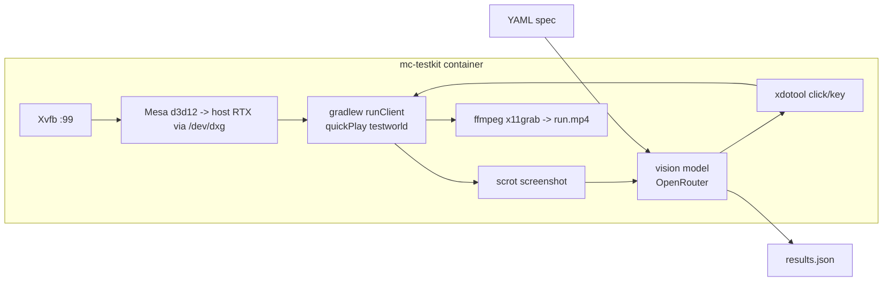

# In-game GUI testing (mc-testkit)

Pathmind's rendered UI — the node editor, overlays, GUI screens — is verified inside a
**real Minecraft 1.21.4 dev client** by the containerized vision testkit. It lives in its
own repo, checked out at `testing/` in the sidequests workspace
([botboy0/mc-testkit](https://github.com/botboy0/mc-testkit)).

**Two-track principle:** anything assertable *without pixels* (item logic, node
execution, persistence) belongs in Pathmind's standard JUnit unit tests. Vision specs are
only for what must *look* right. Same logic as "DOM where possible, vision where
necessary".

## How it works

The pipeline boots the dev client (`gradlew runClient` — no launcher, no account)
GPU-rendered inside a Docker container on WSL2 and executes test steps written in
natural language via a vision model over OpenRouter:



Key properties:

- **Real GPU in the container**: Mesa's `d3d12` gallium driver renders on the host RTX
  through WSL's `/dev/dxg`; the entrypoint hard-fails if the GL renderer is not the real
  GPU (no silent llvmpipe).
- **Deterministic entry**: vanilla quickPlay boots straight into the committed test world
  (`worlds/testworld`, superflat/creative); the world is re-copied pristine every run and
  gamerules (mobs, weather, daylight) are frozen via chat commands typed blindly with
  xdotool. No menu navigation, ever.
- **Vision only where needed**: readiness comes from the client log plus a
  screenshot-stability gate — the model is never polled for "is it loaded yet".
- **Per-run artifacts**: `run.mp4` (full session video), `results.json` (per-step
  outcome, model, tokens, cost, timing), per-step PNGs.
- Warm boot is ~20 s from `gradlew` to in-world; a full 8-step spec costs ~$0.002 with
  the default grounder (`qwen/qwen3.7-plus`).

## Writing and running specs

Specs are YAML with four step kinds — `act` (natural-language instruction, grounded to
one click or keypress), `assert` (visual condition, pass/fail + evidence), `screenshot`
(named artifact), `wait` (seconds or `"settled"`):

```yaml
name: pathmind-editor-smoke
budget_usd: 0.50
steps:
  - act: "Open the player inventory (the key that opens it is 'e')"
  - assert: "An inventory screen is visible (grid of item slots)"
  - act: "Open the Pathmind node editor by pressing the Right Alt key (keysym Alt_R)"
  - wait: settled
  - assert: "A node-based visual editor UI is visible"
  - screenshot: pathmind-editor
```

Run inside WSL (requires `OPENROUTER_API_KEY` in the environment):

```bash
cd testing && bash run-local.sh spec /specs/spec.example.yaml
```

Exit codes: `0` passed · `1` test failure · `2` infra error · `3` budget exceeded.

Details — grounding contract (normalized 0–1000 coordinates), the failure ladder
(parse-retry → escalation model → fail), budget guard, model choice, and the WSLg
fallback — are documented in the testkit's own `README.md`.

## Practical notes

- The Pathmind editor keybind defaults to **Right Alt** (`GLFW_KEY_RIGHT_ALT`) in a
  fresh game dir; K plays, J stops graphs.
- xdotool drives GUI screens reliably; in-world camera movement uses raw relative input
  and cannot be driven by absolute mouse moves — design specs around GUI states.
- Esc behaves as a chain in the Lua editor: close suggestion popup → blur editor → close
  screen. Delete with a node selected (editor *not* focused) deletes the node.
