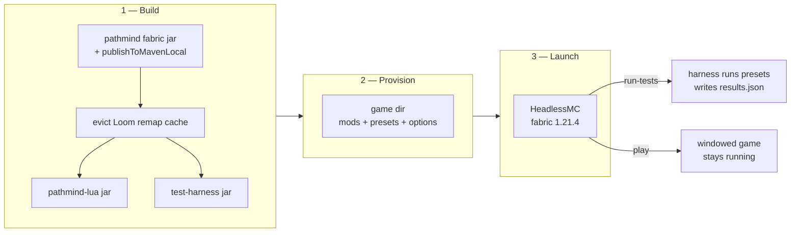
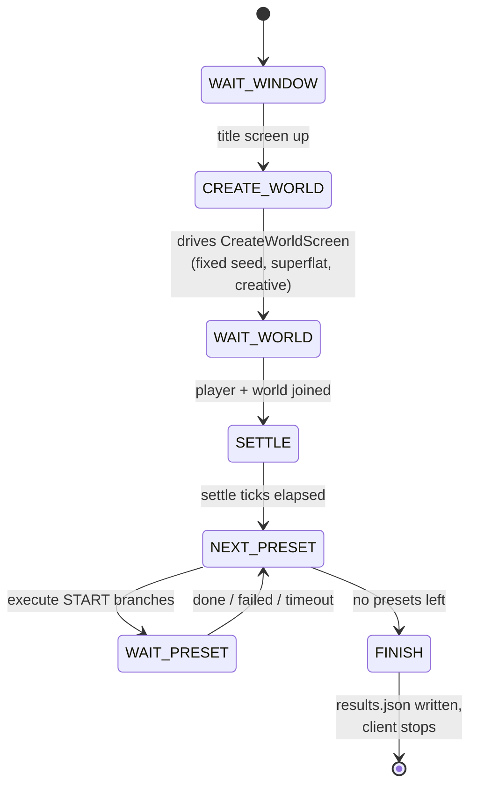
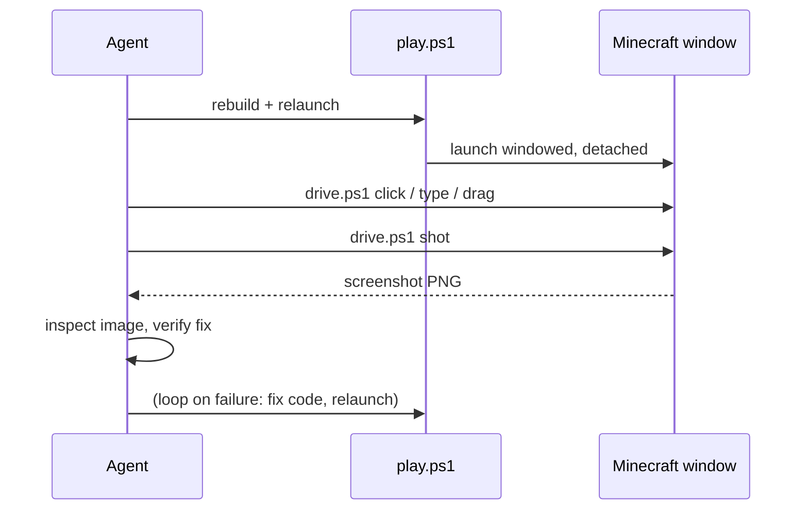

# In-game testing & the autonomous dev loop

Pathmind changes are verified inside a **real Minecraft 1.21.4 client**, not just unit
tests. Two flows share one toolchain (HeadlessMC + a fixed provisioning script), and both
live in the `testing/` folder of the sidequests workspace, one level above this repo:

| Flow | Script | What it's for |
|---|---|---|
| **Automated test suite** | `testing/run-tests.ps1` | Repeatable pass/fail runs of fixture presets in a throwaway world. CI-style evidence. |
| **Play mode** | `testing/play.ps1` | A persistent, windowed dev instance for manual or agent-driven testing. Replaces deploying to the Modrinth App profile. |

Both build the same three artifacts first: the Pathmind fabric jar (published to
mavenLocal so the addon compiles against the current API), the `pathmind-lua` addon, and —
for test runs only — the `pathmind-test-harness` mod.



The **Loom cache eviction** between builds is load-bearing: Loom caches the remapped
`pathmind-fabric` artifact by version coordinate, not content, so a republished jar with
the same version would otherwise be silently ignored by the consumers
(`NoSuchMethodError` at runtime is the classic symptom).

## The automated suite (`run-tests.ps1`)

```powershell
.\testing\run-tests.ps1                                # full suite, headless
.\testing\run-tests.ps1 -SkipBuild -Presets smoke-lua  # fast iteration on one fixture
.\testing\run-tests.ps1 -Mode Rendered                 # real window + screenshots
```

A run wipes and reprovisions `testing/.gamedir`, launches headless (stubbed LWJGL,
offline account), and hands control to the **test harness mod** — inert in normal play,
activated only by the `-Dpathmind.testrun.dir` property. The harness is a tick-driven
state machine:



Each run produces `testing/testruns/<timestamp>/` with `results.json`, `harness.log`,
`latest.log`, crash reports, and (rendered mode) screenshots. Exit code 0 means every
preset passed.

### How a preset passes or fails

A preset **passes** when every START branch completes *and* no node reported a failure
while it ran. The second condition matters: Pathmind node failures complete their
execution futures **normally** — the error only surfaces as a UI notification. The
harness therefore watches `ExecutionManager.getNodeFailureCount()` (fed by the
`NodeExecutionCompletion.fail` path), snapshotting it per preset. This observability hook
exists precisely because automation is otherwise blind to node errors.

### Negative-path fixtures: `*-expectfail`

Presets whose name ends in `-expectfail` invert the verdict: they **pass when a branch
fails** (recorded as `expected failure: <message>`) and **fail if the branch completes**.
Used to prove that uncaught Lua errors stop the graph with a `script:<line>:` chat
message, and that runaway scripts are killed by the compute-time budget. A harness
timeout is never an expected failure.

### Fixture presets

Fixtures live in `testing/fixtures/presets/*.json` — hand-written Pathmind preset files.
Scripts mark checkpoints by setting the Pathmind variable `testpoint`
(`pathmind.setVar("testpoint", "label")`); every change is logged and screenshotted.
The default suite covers the full Phase 2 Lua UAT surface — variable round-trips and
type rejection, game-state queries (loaded and unloaded chunks), awaitable `moveTo` with
arrival assertion, and the two expectfail cases above.

## Play mode (`play.ps1`)

```powershell
.\testing\play.ps1              # build + launch, straight into the last-played world
.\testing\play.ps1 -SkipBuild   # relaunch with existing jars
.\testing\play.ps1 -World dev   # quick play into a specific world folder
.\testing\play.ps1 -World ''    # boot to the title screen instead
```

Play mode launches a **real, windowed** game detached and returns immediately. Unlike the
test suite it uses a **persistent** game dir (`testing/.playdir`): worlds, options, and
presets survive relaunches; only the mod jars are refreshed. First run seeds presets and
options from the Modrinth profile. Windowed mode is enforced on every launch — exclusive
fullscreen hijacks the desktop and defeats screen capture.

**No menu clicking:** by default the game boots directly into the most recently played
world via vanilla quick play (`--quickPlaySingleplayer`, passed through HeadlessMC's
`hmc.gameargs` property). World folder names must not contain spaces — the args property
splits on them (the default dev world folder is `dev`).

**Isolation by default:** after launch the game window is parked on its own Windows
virtual desktop (via the `VirtualDesktop` PowerShell module, auto-installed on first
use), the launcher JVM's console window is hidden, and `pauseOnLostFocus` is disabled.
Stray clicks on the main desktop can't contaminate a test session, and the game doesn't
pause between agent inputs. Pass `-OnMyDesktop` to keep the window on the current
desktop instead.

Requirements: a one-time Microsoft login (`java -jar headlessmc-launcher-2.9.0.jar
--command login` from `testing/.cache`, token cached in `testing/.cache/HeadlessMC/`).
Headless test runs don't need it (offline account).

Why not the Modrinth App profile? Two reasons: the running game locks the mod jars (so
every redeploy needs a manual game restart dance), and nothing about launch or teardown
can be automated. Play mode has neither problem — an agent can kill, rebuild, and
relaunch the instance end to end.

## Agent-driven visual verification (`drive.ps1`)

`testing/drive.ps1` turns the play-mode window into something an AI agent (or a script)
can operate directly — screenshots out, input in — **without touching the real mouse,
keyboard focus, or active desktop**. Input is injected by posting window messages
(`WM_LBUTTONDOWN`, `WM_CHAR`, …) straight to the game's message queue, and screenshots
use `PrintWindow`, which captures unfocused windows on other virtual desktops. A human
keeps working on desktop 1 while the agent drives the game parked on desktop 2.

```powershell
.\testing\drive.ps1 shot editor.png     # capture the MC window to a PNG
.\testing\drive.ps1 click 680 260       # click at window-relative coords
.\testing\drive.ps1 drag 650 190 480 330
.\testing\drive.ps1 type "pathmind."
.\testing\drive.ps1 key 27              # virtual-key press (27 = Esc, 160 = LShift)
```

One caveat of message-based input: it drives GUI screens (the Pathmind editor, menus,
buttons) reliably, but in-world camera movement uses raw input and won't respond —
use fixture presets / Lua `moveTo` for anything that needs the player to act in-world.

Combined with play mode this closes a fully autonomous loop that was used to verify the
Lua editor UX fixes (focus routing, gutter alignment, node dragging) without a human at
the keyboard:



Practical notes for driving the game:

- A solid-color screenshot means the window is minimized or fullscreen — restore it first.
- The Pathmind editor keybind, play, and stop default to whatever `options.txt` holds
  (`key_key.pathmind.*` entries).
- Esc behaves as a chain in the Lua editor: close suggestion popup → blur editor → close
  screen. And Delete with a node selected (editor *not* focused) deletes the node —
  clear text via click-into-editor + Ctrl+A first.
