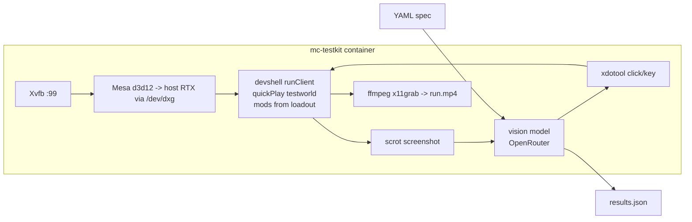

# In-game GUI testing (mc-testkit)

Pathmind's rendered UI — the node editor, overlays, GUI screens — is verified inside a
**real Minecraft 1.21.4 dev client** by the containerized vision testkit. It lives in its
own repo, checked out at `testing/` in the sidequests workspace
([botboy0/mc-testkit](https://github.com/botboy0/mc-testkit)).

**Two-track principle:** anything assertable *without pixels* (item logic, node
execution, persistence) belongs in Pathmind's standard JUnit unit tests. Vision specs are
only for what must *look* right. Same logic as "DOM where possible, vision where
necessary".

## How it works

The pipeline boots a Fabric dev client (`gradlew runClient` from a **source-less
"devshell" project baked into the image** — no launcher, no account, no mod repo
checkout) GPU-rendered inside a Docker container on WSL2. The mods under test —
Pathmind and any addon — arrive **prebuilt via the loadout**; Fabric Loader remaps
the production jars (mixins and access wideners included) to the dev environment at
launch. Test steps are written in natural language and executed via a vision model
over OpenRouter:



Key properties:

- **Real GPU in the container**: Mesa's `d3d12` gallium driver renders on the host RTX
  through WSL's `/dev/dxg`; the entrypoint hard-fails if the GL renderer is not the real
  GPU (no silent llvmpipe).
- **Deterministic entry**: vanilla quickPlay boots straight into the committed test world
  (`worlds/testworld` — vanilla survival, seed `-2350879005487267529`, cherry-grove
  village spawn); the world is re-copied pristine every run and the environment is frozen
  via chat commands typed blindly with xdotool (peaceful, no mob spawning, noon, clear).
  No menu navigation, ever.
- **Vision only where needed**: readiness comes from the client log plus a
  screenshot-stability gate — the model is never polled for "is it loaded yet".
- **Per-run artifacts**: `run.mp4` (full session video), `results.json` (per-step
  outcome, model, tokens, cost, timing), per-step PNGs.
- Warm boot is ~20 s from `gradlew` to in-world; a full 8-step spec costs ~$0.002 with
  the default grounder (`qwen/qwen3.7-plus`).

## Writing and running specs

Specs are YAML with six step kinds — `act` (natural-language instruction, grounded to
one click, keypress, or drag), `assert` (visual condition, pass/fail + evidence),
`key` and `type` (deterministic keypresses/text entry, zero model calls — prefer these
whenever the input is known in advance), `screenshot` (named artifact), `wait`
(seconds or `"settled"`):

```yaml
name: pathmind-editor-smoke
budget_usd: 0.50
steps:
  - act: "Open the player inventory (the key that opens it is 'e')"
  - assert: "An inventory screen is visible (grid of item slots)"
  - act: "Open the Pathmind node editor by pressing the Right Alt key (keysym Alt_R)"
  - wait: settled
  - assert: "A node-based visual editor UI is visible"
  - screenshot: pathmind-editor
```

Run inside WSL (requires `OPENROUTER_API_KEY` in the environment):

```bash
cd testing && bash run-local.sh spec /specs/spec.example.yaml
```

Exit codes: `0` passed · `1` test failure · `2` infra error · `3` budget exceeded.

Details — grounding contract (normalized 0–1000 coordinates), the failure ladder
(parse-retry → escalation model → fail), budget guard, model choice, and the WSLg
fallback — are documented in the testkit's own `README.md`.

## Loadouts: how the mods get into the container

A **loadout** (`LOADOUT=<dir-or-zip>`, default `testing/loadouts/default/`)
mounts an overlay tree for the MC instance: top-level directories (`mods/`,
`config/`, …) are merge-copied over the run dir on every boot, bare `*.jar` files
are shorthand for `mods/`, and a `.wipe` file lists paths to delete first — the
default loadout wipes `pathmind/` so workspace presets reset per boot.

The loadout carries **all mods under test** (the devshell only provides the dev
client plus `fabric-api`/`architectury` as dev-mapped runtime libraries). Both
jars are built on Windows and dropped in — no in-container build, no WSL repo
clone:

```bash
cd pathmind && ./gradlew.bat :fabric:remapJar -Pmc_version=1.21.4
cp fabric/build/libs/pathmind-fabric-*+mc1.21.4.jar ../testing/loadouts/default/
cd ../pathmind-lua && ./gradlew.bat build
cp build/libs/pathmind-lua-0.1.0.jar ../testing/loadouts/default/
```

(Take the plain jars, not `-dev-shadow`/`-sources`. If the Pathmind addon API
changed, run `:fabric:publishToMavenLocal` before building the addon.)

Every run records the loadout manifest (path/size/sha256) in `meta.json`; the run
dashboard lists it per run. Legacy mod-source mode — mounting a Pathmind repo at
`/workspace` (`WORKSPACE_SRC=…` for `run-local.sh`) so the container builds and
boots it from source — still exists for debugging against uncommitted trees, but
the prebuilt-jar loadout is the default and the faster loop.

## Commentary mode

`commentary: true` in a spec (or `COMMENTARY=1` in the env) lets the vision model
report visual oddities — overlapping/clipped text, z-order glitches, artifacts —
independent of any verdict. Findings never affect pass/fail; they land per step in
`results.json` and in the dashboard, which offers a dedicated observations view
with video-timestamp jump links. Treat it as a rendering-lint channel: it found
the suggestion-popup overlap and the `=`-glyph artifact now tracked in the v2
backlog, plus a state-leak bug in the harness itself.

## Vision backends: models per role, subscription broker

The driver uses up to three models per run, each with its own job:

| role | env / spec key | what it does |
|---|---|---|
| grounder | `GROUNDER_MODEL` / `model` | finds things on screen (`act` clicks/drags) — cheap and fast wins |
| assert | `ASSERT_MODEL` / `assert_model` | judges `assert` conditions and writes commentary — a stronger model pays off here |
| escalation | `ESCALATION_MODEL` | retry ladder + second opinion when an assert fails |

By default everything goes to OpenRouter. The host-side **vision broker**
(`testing/tools/vision-broker.py`) additionally exposes subscription backends by
model prefix — `claude/…` uses a Claude Pro/Max OAuth token (`claude setup-token`),
`codex/…` the Codex CLI's ChatGPT login — so assert-quality vision runs on flat-rate
plans (per-run cost 0) instead of API credit. Start the broker, then run with
`BROKER=1`: the three roles default to `auto-*` aliases resolved from
`~/.mc-testkit/broker.json`, which the dashboard's broker card (backend health +
model dropdowns) edits live — the next run picks up whatever the dropdowns say.
OAuth stays in the CLIs; the broker only reads and refreshes their stored tokens.
Details: `testing/README.md`, section *Vision backends (models & broker)*.

## Run dashboard

`bash run-local.sh web` serves a dashboard on `http://localhost:8077` (and, with
DuckDNS/Caddy configured, over HTTPS on the LAN): run history with live status,
pass rate and cost, and a per-run detail view with the recorded video (per-step
▶ timestamps seek directly), step results, screenshots, logs, and the loadout
manifest. See `testing/README.md` for the HTTPS/phone setup.

## Practical notes

- The Pathmind editor keybind defaults to **Right Alt** (`GLFW_KEY_RIGHT_ALT`) in a
  fresh game dir; K plays, J stops graphs.
- xdotool drives GUI screens reliably; in-world camera movement uses raw relative input
  and cannot be driven by absolute mouse moves — design specs around GUI states.
- Esc behaves as a chain in the Lua editor: close suggestion popup → blur editor → close
  screen. Delete with a node selected (editor *not* focused) deletes the node.
