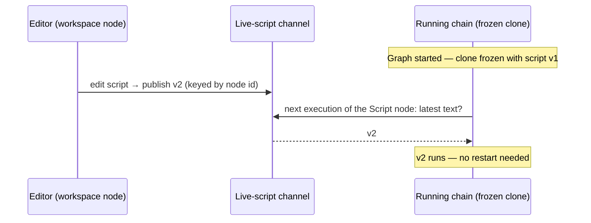

# Lua Scripting Reference

The **Lua Script node** (from the [pathmind-lua addon](https://github.com/botboy0/pathmind-lua)) runs a sandboxed Lua script as a step in your node graph. This page documents everything a script can do.

Ready-to-run example scripts (with importable workspace presets) live in the addon repo's [`examples/`](https://github.com/botboy0/pathmind-lua/tree/main/examples) folder.

## The sandbox

Scripts run on **Cobalt** (a Lua 5.2-family VM) on a background worker thread — a running script never blocks the game. The environment is deliberately restricted:

- **Available:** the Lua base library, `table`, `string`, `math`, `coroutine`, `utf8`, and a Pathmind-provided `print`.
- **Not available:** `io`, `os`, `require`/`package`, and any file or network access. Calling them is a runtime error.
- **Compute budget:** a script gets 5 seconds of *pure compute time*. Time spent waiting inside a blocking call (`moveTo`, `invokeAction`) does not count — a 30-second navigation is fine, but a runaway `while true do end` loop is killed with a timeout error.

## Global functions

### `print(...)`

Prints to the player chat (with the Pathmind prefix). Multiple arguments are joined with tabs, standard Lua-style:

```lua
print("position:", pathmind.getPosition().x)
```

## The `pathmind.*` API

### Variables — `getVar(name)`, `setVar(name, value)`

Read and write **node-tree variables** — the same variables Set Variable / Change Variable nodes use, so scripts and graph nodes can hand data to each other.

```lua
local runs = pathmind.getVar("runs") or 0
pathmind.setVar("runs", runs + 1)
```

- Scalar value types: **number, string, boolean**.
- `getVar` returns `nil` when the variable does not exist.

**Tables** marshal to Pathmind's structured values:

```lua
-- Coordinate table ↔ coordinate variable (usable by any node taking a coordinate)
pathmind.setVar("home", { x = 100, y = 64, z = -20 })
local home = pathmind.getVar("home")   -- { x=, y=, z= }

-- Array table ↔ runtime list (the same lists Create List / Add to List /
-- List Item / Remove from List work with)
pathmind.setVar("waypoints", { {x=0,y=64,z=0}, {x=50,y=64,z=10} })
local ores = pathmind.getVar("ore_positions")  -- e.g. built by a Create List node
for i = 1, #ores do
  pathmind.moveTo(ores[i].x, ores[i].y, ores[i].z)
end
```

- A table with exactly the keys `x`, `y`, `z` (numbers) stores a **coordinate variable**.
- An array table stores a **runtime list**; elements must be uniformly numbers, strings, booleans, or coordinate tables. Empty tables, sparse arrays, mixed keys, and deeper nesting are errors.
- Reading a list built by graph nodes: coordinate entries arrive as `{x=, y=, z=}` tables; scalar entries as their Lua types; opaque entries (entity UUIDs, item ids, GUI slot tokens) as strings.
- Names are shared per namespace: variables and lists live in separate namespaces, and `getVar` checks variables first.

### Navigation — `moveTo(x, y, z)`

Navigates the player to the given coordinates and **blocks until arrival** (or errors when no route exists). The compute-budget clock is paused while waiting.

```lua
local p = pathmind.getPosition()
pathmind.moveTo(p.x + 10, p.y, p.z)
```

**`moveTo` vs. `invokeAction('goto')`** — two deliberately different backends
(verified in-game 2026-07-11):

- `moveTo` always runs on **PathmindNavigator**, Pathmind's own bounded
  walkable-space A*. It is dependency-free and deterministic, but local:
  short-range hops on reasonably open terrain. It does not use Baritone even
  when Baritone is installed.
- `invokeAction('goto', { X=, Y=, Z= })` dispatches a real **GOTO node**
  through the graph pipeline — with the [Baritone API
  mod](https://github.com/cabaletta/baritone/releases) installed (the
  `baritone-api-fabric` variant; the standalone jar proguards the
  `baritone.api` packages away), that means full Baritone pathfinding:
  long-range routes, terrain traversal, its path rendering. Without Baritone
  it falls back to the same built-in navigator.

Rule of thumb: `moveTo` for short scripted hops, `goto` for real journeys.

### Game state — `getPosition()`, `getInventory()`, `getBlock(x, y, z)`

```lua
local p = pathmind.getPosition()      -- { x=, y=, z= }
local inv = pathmind.getInventory()   -- array of { slot=, item="ns:id", count= }
local id = pathmind.getBlock(p.x, p.y - 1, p.z)  -- "minecraft:stone", or nil if unloaded
```

All three are safe snapshots brokered by Pathmind on the game thread — scripts never touch Minecraft state directly.

### Actions — `invokeAction(name, args)`

Invokes **any Pathmind action node** by name and blocks until it completes — the full world/player action surface, without wiring extra nodes into the graph:

```lua
pathmind.invokeAction('message', { text = 'hello from Lua' })
pathmind.invokeAction('jump')
pathmind.invokeAction('press_key', { Key = 'GLFW_KEY_W', Duration = 0.5 })
pathmind.invokeAction('goto', { X = 100, Y = 64, Z = -20 })
```

- **`name`** is a Pathmind node-type name, case-insensitive: `jump`, `look`, `walk`, `message`, `equip_hand`, `drop_item`, `use`, `break`, `goto`, and every other world/player action you see in the sidebar.
- **`args`** is an optional table mapping the node's **parameter names** (as shown on the node in the editor, case-insensitive) to number/string/boolean values. For `message`, the key `text` sets the message text.
- **Errors are loud:** an unknown action name or an argument that matches no parameter raises a Lua error listing the valid parameter names — typos never silently no-op.
- **Not invocable:** flow control (`control_if`, `start_chain`, …), sensors, data/list operations, and parameter nodes. Scripts have Lua's own control flow and `getVar`/`setVar` instead.
- **The one FLOW exception — `wait`:** the native WAIT node is invocable (`pathmind.wait_({ Duration = 1 })`, default mode seconds). A timed pause is a primitive scripts genuinely need, most commonly to give the client a tick or two to open a GUI between an `interact_` and a `craft_` — INTERACT completes when the click is sent, not when the resulting screen has opened.

### Direct action calls — `pathmind.<action>_({...})`

Every invocable action is **also a direct function** on the `pathmind` table — the
bindings are generated at runtime from Pathmind's action catalog
(`PathmindRuntime.listActions()`), so new node types appear automatically with no
addon update. Generated action functions carry a **trailing underscore**:

```lua
pathmind.jump_()
pathmind.message_({ text = 'hello from Lua' })
pathmind.press_key_({ Key = 'GLFW_KEY_W', Duration = 0.5 })
pathmind.goto_({ X = 100, Y = 64, Z = -20 })
```

The underscore is one uniform rule for the whole generated surface. It marks
"this dispatches a Pathmind action node and takes a single args table", and it
lifts every action name out of Lua's reserved-word space (`goto`, `break` are
Lua keywords — `goto_`, `break_` are plain identifiers, so the same dot syntax
works for all 40+ actions with no bracket-access special case). Curated
functions with positional parameters (`moveTo(x, y, z)`, `getVar(name)`) stay
camelCase without the suffix. There are **no bare-name aliases**: `pathmind.jump`
does not exist, only `pathmind.jump_`.

Since the args table is the only argument, Lua also accepts the paren-free sugar
form `pathmind.message_{ text = 'hi' }` — identical call, style preference.

These are sugar over `invokeAction` — same argument matching, same blocking
semantics, same loud errors. Note that `invokeAction` itself keeps the **plain
catalog name as a string**: `pathmind.invokeAction('goto', { X = 0, Y = 64, Z = 0 })`
(no underscore — the string is data, not an identifier, so no collision exists).
The generated signature reflects the action's *default node mode* (e.g. `goto_` =
X/Y/Z coordinates). Other modes are selected with the optional **`Mode`** argument —
a case-insensitive node-mode name; the remaining args must then match that mode's
parameters:

```lua
pathmind.goto_({ Mode = "goto_block", Block = "grass_block" })  -- nearest grass block
pathmind.goto_({ Mode = "goto_y", Y = 30 })                     -- to a Y level
pathmind.goto_({ Mode = "goto_xz", X = 100, Z = -20 })          -- XZ, Y = surface
```

An unknown mode, or a mode that belongs to a different node type, raises a Lua
error listing the action's valid modes.

Pathmind graph nodes deliberately continue the graph after an action failure: they
show an error and record the failure, but complete their internal future normally.
The addon API snapshots that failure record around each `invokeAction` call and turns
a newly recorded failure into a Lua error. As a result, coordinate-directed placement
(`place_({ Block=, X=, Y=, Z= })`) raises when the server rejects placement or the
requested block does not appear at the exact target coordinates, while regular graph
PLACE nodes retain their existing continue-on-error behavior.

This strictness covers the full action surface: a 2026-07-12 sweep routed every
executor failure path that used to complete silently (crafting failures such as
missing ingredients or a closed crafting screen, no matching hotbar item, invalid
inventory slot selections, GUI clicks without an open screen, unknown key/mouse
names, unresolved entity/item/player parameters, list-item lookups, and more)
through the shared failure record. If an action could not do what you asked,
the corresponding `pathmind.*_` call raises with the executor's actual error
message — wrap calls in `pcall` where you want to handle the failure yourself.

### External editors — generated LuaCATS definitions

On first editor open the addon writes `<minecraft>/pathmind/pathmind-api.lua` — a
[LuaCATS](https://luals.github.io/wiki/annotations/) `---@meta` stub covering the
whole API (curated functions + every catalog action, with `---@param` annotations
and the node descriptions as doc comments). Point a VS Code workspace with the
[Lua language server (sumneko/LuaLS)](https://marketplace.visualstudio.com/items?itemName=sumneko.lua)
at that file (`Lua.workspace.library`) and you get full IntelliSense — completion,
signatures, hovers — when writing Pathmind scripts externally.

## Error handling

An uncaught script error stops the graph at the Script node, prints `Lua error: script:LINE: message` to chat, and shows a persistent red **error strip** on the node (`⚠ Line N: …`). The strip:

- shows the first line of the error; hover it for the full message including the stack traceback,
- **dims to gray** once you edit the script (the line number may no longer match),
- clears on the next successful run.

Use `pcall` for errors you want to handle inside the script:

```lua
local ok, err = pcall(function()
  pathmind.invokeAction('goto', { X = 0, Y = 64, Z = 0 })
end)
if not ok then
  print('navigation failed: ' .. err)
end
```

## Editor

The Script node body is an inline editor with a line-number gutter, syntax highlighting, and autosuggestions. Esc with no popup open blurs the editor; a second Esc closes the node editor screen.

### Code completion

Completion works in two modes:

- **While typing**, the popup opens automatically when a line ends with `pathmind.` — it lists the **entire API surface alphabetically** (curated functions plus all ~44 catalog actions under their underscore names), each with an argument hint derived from the node definitions (`press_key_ ({Key, Duration})`, `collect_ ({Block, Amount})`), and a detail strip below the popup shows the selected entry's description (e.g. *"Breaks a targeted or specified block"*). Plain identifier prefixes filter keywords, the small stdlib set, and the `pathmind` module itself (so typing `p` offers `pathmind` next to `print` and `pairs`).
- **Ctrl+Space** requests completion explicitly, Eclipse-style: with a prefix under the cursor it shows the same filtered results; on a blank line it opens the full discovery list — the qualified `pathmind.*` API entries first (insertable as-is), followed by Lua keywords and stdlib. Lists longer than the visible rows scroll with the keyboard selection.

Up/Down selects, Enter accepts, Esc closes the popup without blurring the editor. Accepting replaces the token before the cursor and inserts a **complete call**: parameterless functions get `()` (`pathmind.jump_()`), actions with arguments get `({})` with the cursor placed inside the args table — ready to type the arguments, with signature help showing. The accepted line always compiles as-is. Accepting `pathmind` and typing `.` chains straight into the function list.

### Diagnostics and signature help

The buffer is compiled (not run) as you edit: syntax errors appear immediately in the error strip below the editor with their line number, visually distinct from runtime errors reported by an actual run. When the cursor sits inside the parentheses of a known `pathmind.*` call, a hint shows the function's signature.

### Syntax highlighting

Lua code is colored as you type: keywords in amber, strings in green, comments in gray, numbers in light blue, and the `pathmind.*` API (plus `print`) in sky blue. Multi-line constructs — long strings (`[[…]]`, `[=[…]=]`) and long comments (`--[[…]]`) — are colored across all the lines they span. An unterminated string is colored to the end of its line (short strings) or to the end of the script (long brackets), which makes runaway literals easy to spot before running.

### Script hot-reload

Script edits take effect **without restarting the graph**. When a graph starts, Pathmind executes a frozen snapshot of the nodes — but Script nodes always read the *live* editor text at the moment they execute. So if a running chain reaches (or loops back to) a Script node after you've edited it, the new code runs.

The granularity is per-execution: an edit never interrupts a script that is already mid-run; it applies from the next execution of that node onward.


